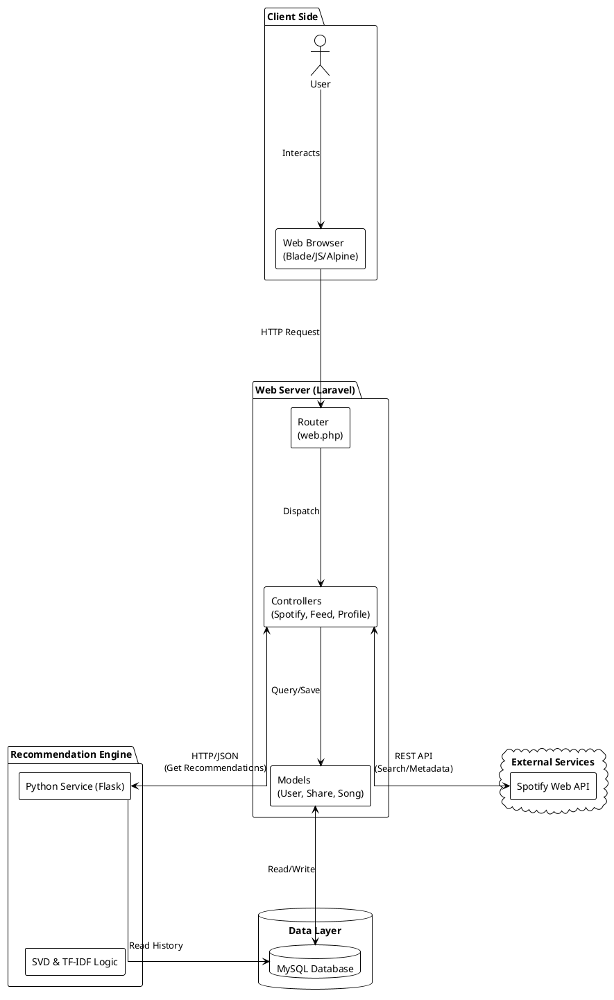

# Technical Architecture Overview

## 1. Overall System Architecture

The following diagram illustrates the data flow between the Client, the Laravel Web Server, the MySQL Database, and the external/internal services.

### High-Level Architecture Diagram


---

## 2. The System Flow: From Input to Intelligence

The data lifecycle follows a linear path: **Ingress (Sharing)** → **Engagement (Interactions)** → **Intelligence (Processing)** → **Egress (Discovery)**.

### Phase 1: Data Ingress (Sharing a Song)
**Goal:** Capture content and build a rich metadata profile.
**Primary View:** `resources/views/shares/show.blade.php`

The system fetches external metadata (Spotify, MusicBrainz, Discogs) to power the **TF-IDF Algorithm**.

**Code Snapshot: `ShareController.php`**
```php
public function store(Request $request)
{
    // ... validation ...
    
    // 1. Fetch Core Data (Spotify)
    $trackData = $this->spotifyService->getTrack($validated['spotify_track_id']);
    $song = $trackData['song'];

    // 2. Enhance Metadata (External APIs)
    // Fetches deep genre/style data from MusicBrainz & Discogs
    $musicBrainzGenres = $this->musicBrainzService->getArtistGenres($song->artist_name);
    $discogsGenres = $this->discogsService->getGenres($song->artist_name, $song->track_name);
    
    // 3. Save Rich Keyword Vector
    $song->update(['genres' => json_encode(array_unique($genres))]);
    
    // ... create share record ...
}
```

### Phase 2: User Engagement (The Feedback Loop)
**Goal:** Generate signal data for the recommendation engine.
**Primary View:** `resources/views/dashboard.blade.php`

User interactions (Likes, Comments, Bookmarks) provide explicit signals for **Collaborative Filtering**.

**A. Binary Feedback (Likes/Dislikes)**
Clean positive/negative signals using mutual exclusivity.
```php
// LikeController.php
public function toggle(Share $share)
{
    $user = auth()->user();

    // 1. Ensure Mutual Exclusivity
    if ($user->dislikes->contains($share)) {
        $user->dislikes()->detach($share);
    }

    // 2. Toggle Like
    $user->likes()->toggle($share);

    return response()->json([
        'liked' => $user->likes->contains($share),
        'disliked' => false
    ]);
}
```

**B. Curatorial Feedback (Bookmarks)**
High-intent "saves" for profile building.
```php
// ShareController.php
public function toggleBookmark(Share $share) {
    auth()->user()->bookmarks()->toggle($share);
    return response()->json(['bookmarked' => ...]);
}
```

**C. Social Feedback (Comments)**
Community depth with threading and mentions.
```php
// CommentController.php
public function store(Request $request, Share $share) {
    // 1. Create Comment
    $comment = $share->comments()->create([...]);

    // 2. Handle Threading & Mentions
    if (isset($validated['parent_id'])) { /* ... */ }
    $this->handleMentions($comment);

    return view('components.comment', ['comment' => $comment])->render();
}
```

### Phase 3: Intelligence Processing (Netcentric Service)
**Goal:** Offload heavy computation to Python Microservice.

**Code Snapshot: `RecommendationService.php`**
```php
public function getRecommendations(int $userId): array
{
    // 1. Build Microservice URL
    $url = $this->pythonServiceUrl . '/recommendations/' . $userId;
    
    // 2. Call Python Service (Synchronous)
    $response = Http::timeout(5)->retry(3, 1000)->get($url);

    if ($response->successful()) {
        return $response->json()['recommendations'] ?? [];
    }
    
    return [];
}
```

### Phase 4: Data Egress (Discovery Page)
**Goal:** Deliver personalized recommendations.
**Primary View:** `resources/views/discovery.blade.php`

Combines "Intelligent IDs" with local data to hydrate the view.

**Code Snapshot: `DiscoveryController.php`**
```php
public function index()
{
    $user = Auth::user();
    
    // 1. Get Intelligent IDs (from Python Service)
    $rawRecommendations = $this->recommendationService->getRecommendations($user->id);
    
    if (!empty($rawRecommendations)) {
        $recommendedSongIds = collect($rawRecommendations)->pluck('song_id')->all();

        // 2. Contextual Filtering (Exclude previous interactions)
        $interactedSongIds = SongInteraction::where('user_id', $user->id)
                                ->pluck('song_id')->toArray();
                                
        $filteredSongIds = array_diff($recommendedSongIds, $interactedSongIds);
        
        // 3. Hydrate & Re-sort by Algorithm Score
        $recommendedSongs = Song::whereIn('id', $filteredSongIds)->get();
        
        $recommendationData = collect($rawRecommendations)->keyBy('song_id');
        $recommendedSongs = $recommendedSongs->sortByDesc(function ($song) use ($recommendationData) {
            return $recommendationData[$song->id]['score'] ?? 0;
        });
    }

    return view('discovery', compact('recommendedSongs'));
}
```

---

## 3. Netcentric Elements
The application relies on two critical network-based integrations to function. These "Netcentric" elements connect the core web server to external data sources and internal specialized services.

### Element A: Spotify API Integration (External)
*   **Role**: Content Aggregation & Metadata Authority.
*   **Protocol**: REST API (HTTPS).
*   **Function**: Instead of storing millions of songs locally, the system queries Spotify's vast database in real-time.
*   **Key Operations**:
    1.  **Search**: When a user types a song name, the backend proxies a request to `api.spotify.com/v1/search`.
    2.  **Metadata**: Retrieves high-quality album art, artist names, and preview URLs (where available).
    3.  **Token Management**: Uses OAuth Client Credentials flow for secure server-to-server communication.

### Element B: Recommendation Microservice (Internal)
*   **Role**: Intelligent Decision Support.
*   **Protocol**: HTTP/JSON (Microservice).
*   **Function**: Offloads computationally intensive Machine Learning tasks from the main PHP web server.
*   **Workflow**:
    1.  **Trigger**: User visits the "Discovery" page.
    2.  **Request**: Laravel sends a generic GET request to the Flask service (e.g., `http://localhost:5000/recommend/{user_id}`).
    3.  **Processing**: The Python service connects directly to the readout replica of the MySQL database to analyze millions of interactions using **SVD (Singular Value Decomposition)** and **TF-IDF**.
    4.  **Response**: Returns a lightweight JSON list of recommended Song IDs (e.g., `[102, 405, 99]`) which Laravel then hydrates with full details.


### Ancillary Views
**User Configuration:** `resources/views/settings/index.blade.php`
Handles user account management, profile settings, and preference configuration.

---

