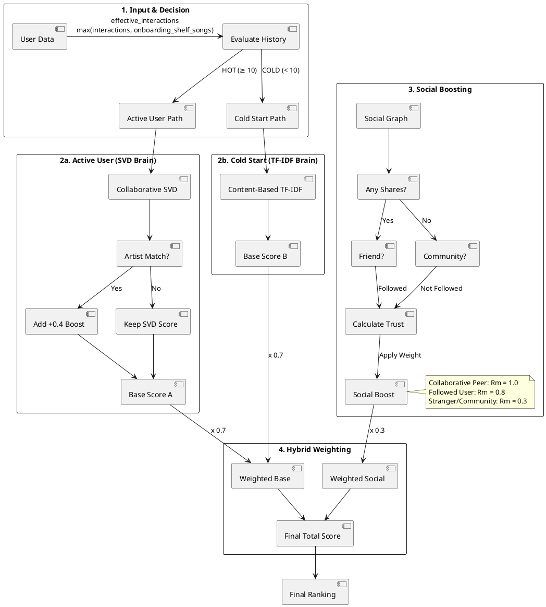

# Recommendation Engine Logic (Corrected)

This document represents the actual implemented logic of the MusicSocial recommendation system as of Jan 2026.

## 1. Data Sources (Inputs)
The system aggregates user-song interactions from four primary tables to build the "Weighted Interaction Score":

| Table | Interaction Type | Weight (Points) | Purpose |
| :--- | :--- | :--- | :--- |
| **shares** | Share | **3.0** | Strongest explicit endorsement. |
| **likes** | Like | **2.0** | Explicit positive feedback. |
| **song_interactions** | Like | **2.0** | Direct player like. |
| **song_interactions** | Listen | **1.0** | Passive listening history. |
| **comments** | Comment | **1.0** | Engagement/Discussion. |
| **dislikes** | Dislike | **-1.0** | **Filtering**: Removes song from recommendations. |
| **song_interactions** | Dislike | **-1.0** | **Filtering**: Removes song from recommendations. |

> **Note**: Explicit "filtering" means if a user has disliked *or* already listened to a song (present in `song_interactions`), it is excluded from the discovery list.

---

## 2. The Algorithm Flow

The system uses a **Hybrid** approach, splitting logic into two distinct paths:

1.  **Collaborative Filtering (SVD)**:
    *   **Input**: User ID × Song ID Matrix.
    *   **Logic**: "People who liked the songs you liked *also* liked Song X."
    *   **Role**: Finds hidden patterns and "crowd wisdom."

2.  **Content-Based Filtering (Cold Start / Boost)**:
    *   **Input**: User Profile × Song Metadata (Artist + Genre).
    *   **Logic**: TF-IDF Vectorization of artists and genres.
    *   **Role**: Handles new users/songs by matching textual features (e.g., "Pop", "Taylor Swift").

### Visualization

### PlantUML Version

---

## 3. The Master Equation (Corrected Math)

The final score is a result of fusing two distinct "brains":

### A. The Two Brains
1.  **SVD Brain (Collaborative Filtering)**
    *   **Input**: User × Song data (specifically interactions like Shares/Likes).
    *   **How it works**: It doesn't know *anything* about genres or artists. It only knows detailed patterns like *"User A liked Song 1, and User B liked Song 1, so User A might like Song 2 which User B also liked."*
    *   **Result**: Finds hidden connections (e.g., people who like metal often like anime soundtracks, even if the genres don't match).

2.  **Content-Based Brain (TF-IDF)**:
    *   **Input**: User × Genre/Artist metadata.
    *   **How it works**: This part *does* look at metadata. *"You liked 'Taylor Swift' (Pop), so here is 'Ariana Grande' (Pop)."*

### B. The Formula
The final score is computed by scaling the Base Score (algorithmic preference) and the Social Trust score (peer engagement):

**Total Score = ((Base Score) × 0.7) + (Social Trust × 0.3)**

Depending on the user's history and onboarding status, the system evaluates **effective interactions** — calculated as `max(interactions, onboarding_shelf_songs)`. Since onboarding is mandatory and forces users to pick at least 5 songs, every user starts with at least 5 effective interactions. The **"Base Score"** then comes from one of two primary scenarios:

### Scenario A: The Active User (Hybrid SVD)
*   **Condition**: User has `≥ 10` effective interactions.
*   **Base Source**: `SVD Score + 0.4 (Context Boost)` (where SVD predicts user ratings on a 1-5 scale, and +0.4 is added for explicit artist matches).
*   **Example Calculation**:
    *   **SVD Prediction**: `4.5`
    *   **Context Boost**: `+0.4` (Explicit Artist Match)
    *   **Adjusted Base**: `4.9`
    *   **Final Score**: `(4.9 × 0.7) + (Social Trust × 0.3)`

### Scenario B: The Onboarding / Cold Start (Content-Based)
*   **Condition**: User has `< 10` effective interactions (typically `5 to 9` interactions, including new users who just completed onboarding with exactly 5 shelf songs).
*   **Base Source**: `TF-IDF Cosine Similarity` (compares candidate songs to the user's taste profile vectors; yields scores from 0.0 to 1.0).
*   **Example Calculation**:
    *   **User History**: Liked/shelved a song by *Metallica* (Tags: "Thrash Metal", "Heavy Metal").
    *   **Candidate Song**: A song by *Megadeth* (Tags: "Thrash Metal", "Speed Metal").
    *   **TF-IDF Similarity**: **0.85** (High score because unique keywords overlap significantly).
    *   **Context Boost**: **0.0** (Implicit in the similarity score).
    *   **Final Score**: `(0.85 × 0.7) + (Social Trust × 0.3)`

> **Key Difference**: Active users (≥ 10 interactions) get an *explicit* math boost (+0.4) on top of collaborative filtering SVD predictions to prioritize favorite artists. Onboarding and cold-start users (< 10 interactions) get an *implicit* boost because TF-IDF text matching naturally yields high similarity scores for direct genre/artist keyword overlaps. (Note: A global popularity fallback exists in the code as a database safety net for `< 5` interactions, but is unreachable under normal operation due to forced onboarding).

---

## 4. Social Trust Algorithm (The "Why")

This is the system's "Network Theory" component. It dynamically calculates how much weight to give a social recommendation based on two factors: **Influence** and **Dilution**.

### The Formula (Specific Power Log)
**Trust Score = ln(1 + |Them|^0.7) / (1 + 0.5 × ln(1 + |You|))**

*   **You**: The number of people *you follow* (Your "Selectivity").
*   **Them**: The number of followers *the sharer has* (Their "Influence").

### Logic Explained
1.  **Relationship Multiplier ($R_m$)**:
    *   **Collaborative Playlist Peer**: **$R_m$ = 1.0** (Highest trust, overrides standard follow)
    *   **Followed User**: **$R_m$ = 0.8** (Standard follower/friend trust)
    *   **Stranger/Community**: **$R_m$ = 0.3** (Stranger recommendation trust)

2.  **Mitigating Influence (Power Log)**: `ln(1 + |Them|^0.7)`
    *   The `^0.7` exponent dampens the value *before* the log is taken.
    *   **Effect**: Reduces the gap between "superstars" and "regulars".

3.  **Mitigating Dilution (0.5 Factor)**: `1 + 0.5 × ln(1 + |You|)`
    *   **Effect**: The `0.5` multiplier halves the penalty for following many people. Note that we take `ln(1 + |You|)` to handle the "0 followers" case safely.

---

## 5. Real-World Example: The Journey of a Song

Let's imagine a user, **Alice**, who loves *Indie Pop*.

### Step 1: Filtering
The system looks at **Song X** (Indie Pop).
*   Has Alice disliked it? **No.**
*   Has she heard it before? **No.**
*   *Result: Song X is a valid candidate.*

### Step 2: The Two Brains (Alice is an Active User)
Since Alice has 50+ interactions, she uses the **SVD Brain**.
*   **SVD Prediction**: The model predicts a score of **4.2** based on her history.
*   **Context Boost**: Song X is by *Clairo* (an artist Alice follows).
    *   Boost: **+0.4**
    *   Base Score = 4.2 + 0.4 = **4.6**

### Step 3: Social Trust
Alice's friend **Bob** shared this song.
*   **Bob's Influence**: He has 500 followers. `ln(1 + 500^0.7)` ≈ **4.35**
*   **Alice's Selectivity**: She follows 50 people. `1 + 0.5 × ln(1 + 50)` ≈ **2.97**
*   **Trust Score**: 4.35 / 2.97 ≈ **1.46**
*   **Relationship**: Bob is a Collaborative Playlist Peer ($R_m$ = 1.0) -> Score stays **1.46**.

### Step 4: The Master Equation
*   **Weighted Base**: 4.6 × 0.7 = **3.22**
*   **Weighted Social**: 1.46 × 0.3 = **0.44**
*   **Final Score**: 3.22 + 0.44 = **3.66**

**Result**: Song X appears near the top of her "Suggested for You" list with the label: *"Shared by Bob · You like Clairo"*.

---

## 6. Technical Implementation
*   **Language**: Python 3.10 (Microservice)
*   **Libraries**:
    *   `Surprise`: For SVD Matrix Factorization.
    *   `Scikit-learn`: For TF-IDF and Cosine Similarity.
    *   `Pandas`: For high-performance dataframe manipulation.
    *   `SQLAlchemy`: For efficient batch database querying.
*   **Performance**: The system caches the TF-IDF matrix to ensure "Cold Start" calculations happen significantly faster (under 200ms).
